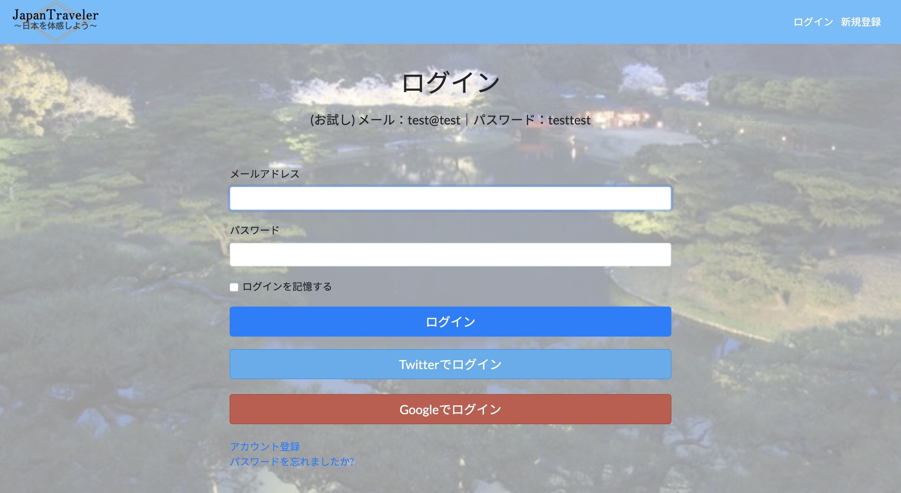
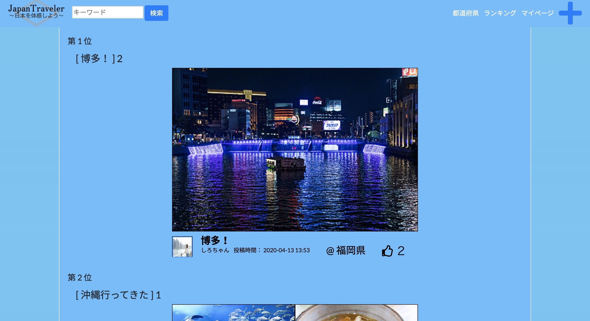

# JapanTraveler ※現在停止中

## 概要
### 🌐  App URL
### **http://japan-traveler-blog.com/**
日本国内の様々な都道府県を体感していただけるサイトです。 
日本国内に特化した旅行系ブログアプリとなっております。 
* BASIC認証 
ID : japan 
PW : kagawa  
* テスト用アカウント 
メールアドレス : test@test 
パスワード : testtest 

## 使用言語・構築方法 
Haml・SCSS・Bootstrap・Ruby・RubyonRails・Javascript・jQuery・AWS(EC2,S3,Route53)・MySQL・nginx・Unicorn・Capistrano

## 目的
* 日本人として日本のことをより深く知っておきたいから。 
* 将来、色々な都道府県に行ってみたいから。 
* 地方出身(香川県出身)として、地方ならではの良いところを共有したいから。 

## 主な仕様
* 記事 一覧/投稿/詳細/編集/削除 
* ユーザー管理(devise) 登録/マイページ/コメント/ 
* 画像投稿 
* ページネーション 
* 都道府県タグ 
* 記事検索 
* いいね機能 
* 都道府県検索・用語検索 
* いいねランキング 
* タグ機能・タグ検索機能 
* レスポンシブ対応 

## 使い方
* トップページ画面では、記事の一覧を閲覧することができます。 
* ログイン画面です。アカウントを持っていない場合は新規作成ボタンをクリックしてアカウントを登録します。TwitterまたはGoogleのアカウントを使ってログインすることが可能です。 

* 新規投稿画面です。 

* 記事詳細画面です。気に入った記事に対していいねボタンを押すことができます。ログインユーザーが投稿した記事の場合、編集と削除を行うことができます。下から記事のコメントを投稿することができます。 

* マイページの画面です。ユーザーの情報、投稿した記事の一覧を見ることができます。 

* いいねランキングの画面です。いいねの数が多い記事順に表示されます。 

* 都道府県検索の画面です。キーワードの検索を行うこともできます。 

* ...
